# ZodiFind  
A mobile app that reads your stars to reveal your past, guide your present, hint at your future, and uncovers hidden aspects you didn’t even know about yourself.

## 🚀 Main Features  
1. **Astrology** - Reads your zodiac sign to reveal your core qualities.
2. **Tarot Reading** - Reads your fortune to guide and warn you of what's to come.
3. **Palmistry** - Reads your palm lines to reveal a secret map of your destiny.
   
## ✏️ In-Depth Features  
1. **Zodiac Wheel** - Can be rotated for fun.
2. **Zodiac Library** - Discover origin stories, facts, and trivia related to each zodiac sign.  
3. **Zodiac Sign Calculator** - Input your birthdate and discover your zodiac sign.  
4. **Tarot Deck** - Draws 3 cards for your past, present, and future.
5. **Palmistry Camera** - Scans your palm lines in real time to show you the palm map template.
6. **Palm Lines Library** - Discover different characteristics of palm lines and what they mean.
7. **Profile Page** - Allows full customization of user profile.

## 🛠️ Tech Stack  
1. **Language** - Kotlin  
2. **Libraries**  
   - `commandiron.WheelPickerCompose`
   - `ArtielSry.KotlinAndroidApp_Horoscope`
   - `cocorrina - Divine Feminine Tarot Guide`

## 🧠 Developers  
1. Jatayna, Aaron Dei V.  
2. Juarez, Venice Jonah D.

### CSIT 284 — PLATFORM-BASED DEVELOPMENT (MOBILE DEVELOPMENT)

## Demonstration
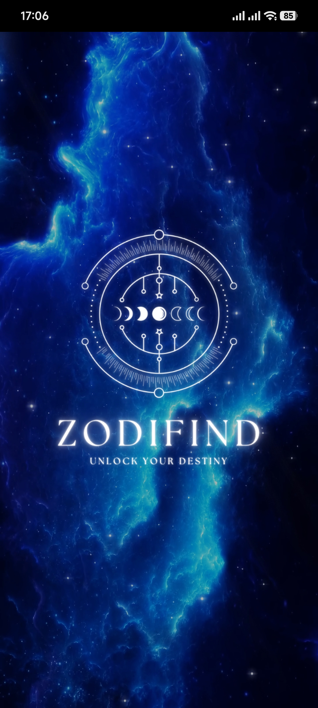
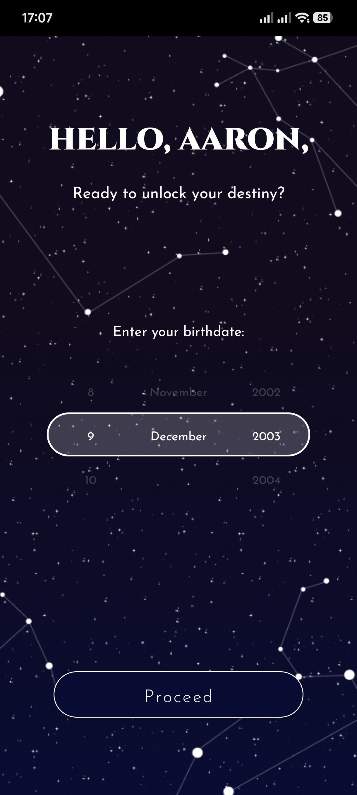
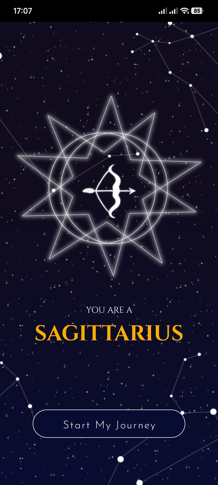
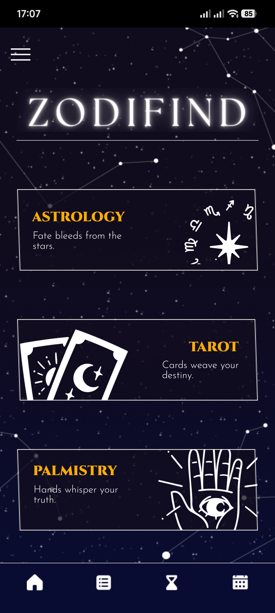
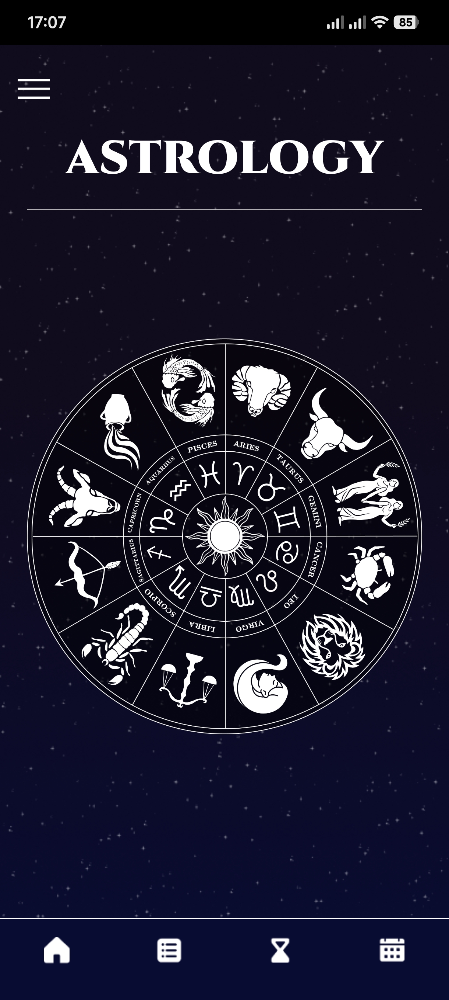
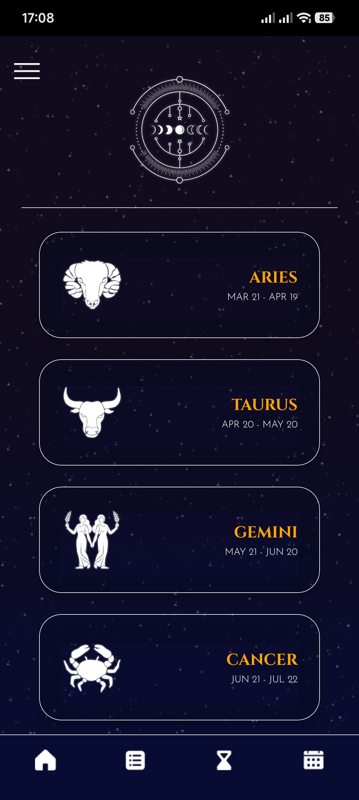
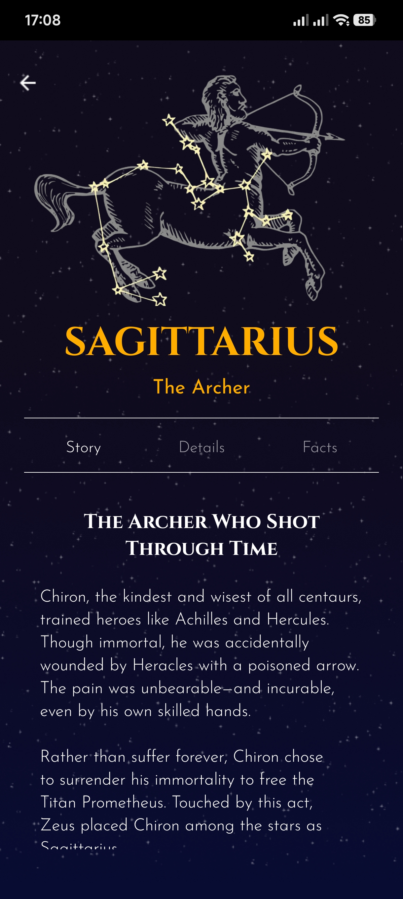
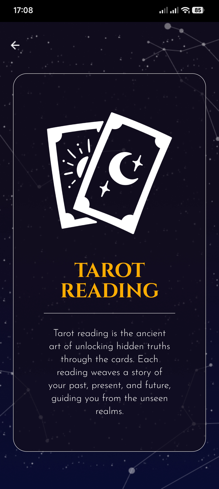
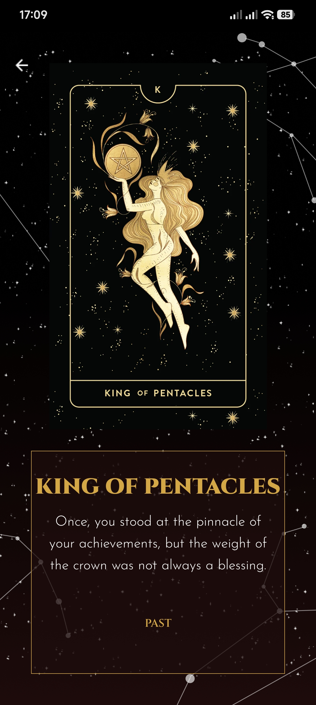
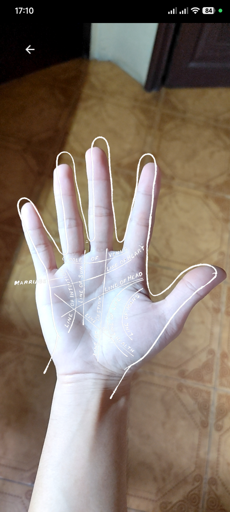
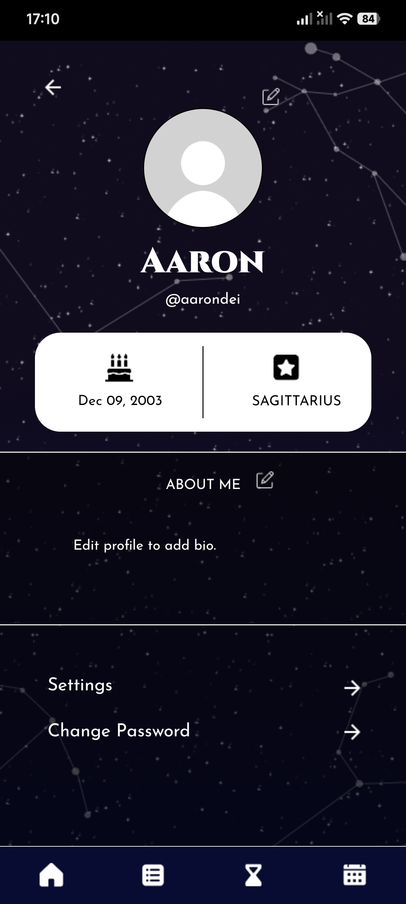
